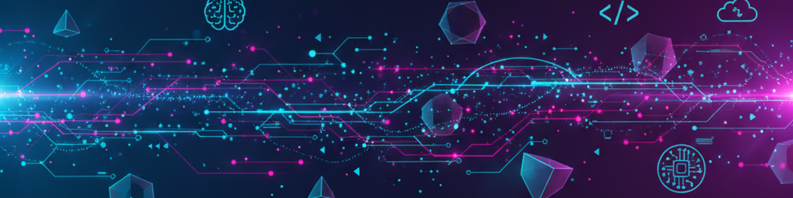
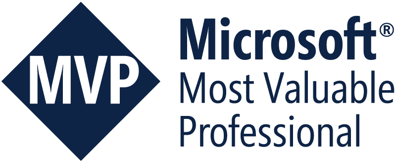
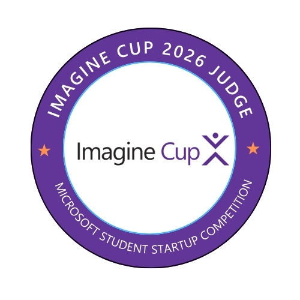

 

&nbsp;&nbsp;
&nbsp;&nbsp;
&nbsp;&nbsp;

## About Me

AI Solution Architect and Entrepreneur leading high-impact **Generative AI** and **AI Agent** projects across EMEA. I transform complex business challenges into innovative platforms using cutting-edge AI technologies.

<table>
<tr>
<td width="50%">

### 🎯 Currently
- 🏢 AI/Data Solution Architect
- 🌍 Based in **Madrid, Spain** & **Tenerife, Spain** 
- 🔭 Building **Machine Learning / Generative AI Architectures**
- 🎤 Speaker at **Microsoft events** & **Bootcamps**

</td>
<td width="50%">

### 🏆 Recognition
- 🥇 **Microsoft AI MVP** (2020-2026)
- 📅 6 consecutive years awarded
- 🎓 University Guest Lecturer
- 🌐 Languages: 🇪🇸 Spanish · 🇬🇧 English

</td>
</tr>
</table>

## Tech Stack

<table>
<tr>
<td align="center" width="50%">

**🤖 AI & Machine Learning**

</td>
<td align="center" width="50%">

**☁️ Cloud & Infrastructure**

</td>
</tr>
<tr>
<td align="center">

**🧠 GenAI & Agentic AI**

</td>
<td align="center">

**📊 Data & MLOps**

</td>
</tr>
</table>

<b>🔧 More Technologies</b>

 

<table>
<tr>
<td align="center"><b>🤖 LLMs</b></td>
<td>

</td>
</tr>
<tr>
<td align="center"><b>🔗 Agentic</b></td>
<td>

</td>
</tr>
<tr>
<td align="center"><b>🗄️ Vector DBs</b></td>
<td>

</td>
</tr>
<tr>
<td align="center"><b>⚙️ MLOps</b></td>
<td>

</td>
</tr>
<tr>
<td align="center"><b>📈 Data</b></td>
<td>

</td>
</tr>
</table>

## Awards & Recognition

<table>
<tr>
<td align="center">

 <b>Microsoft AI MVP</b> 
5 consecutive years (2020-2025)
</td>
<td align="center">

 <b>Microsoft Student Partners</b> 
2015 - 2018
</td>
<td align="center">

 <b>Imagine Cup Judge</b> 
Microsoft Student Competition
</td>
</tr>
</table>

---

Building the future of AI, one agent at a time.

