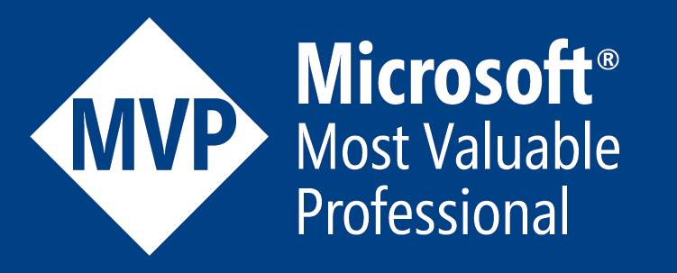
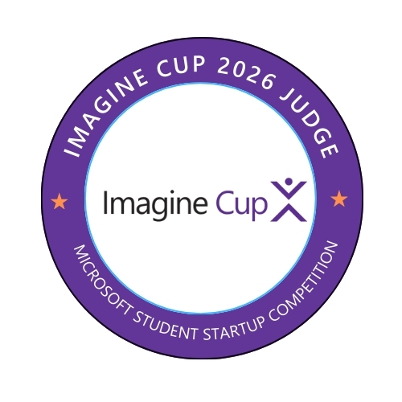

## Alexander González  
**AI Cloud Solution Architect**

Microsoft AI MVP · Speaker · Enterprise AI & Cloud Architectures

&nbsp;&nbsp;
&nbsp;&nbsp;
&nbsp;&nbsp;

Designing production-grade data, AI, and cloud solutions.  
Helping organizations turn complex business challenges into scalable, enterprise-ready platforms.

## Focus Areas

Generative AI · AI Agents · Data Platforms · Cloud Architecture · MLOps

## Awards & Recognition

<table>
<tr>
<td align="center">

 <b>Microsoft AI MVP</b> 
6 consecutive years (2020-2026)
</td>
<td align="center">

 <b>Microsoft Student Partners</b> 
2015 - 2018
</td>
<td align="center">

 <b>Imagine Cup Judge</b> 
Microsoft Student Competition
</td>
</tr>
</table>

---

Building practical AI systems with enterprise impact.

